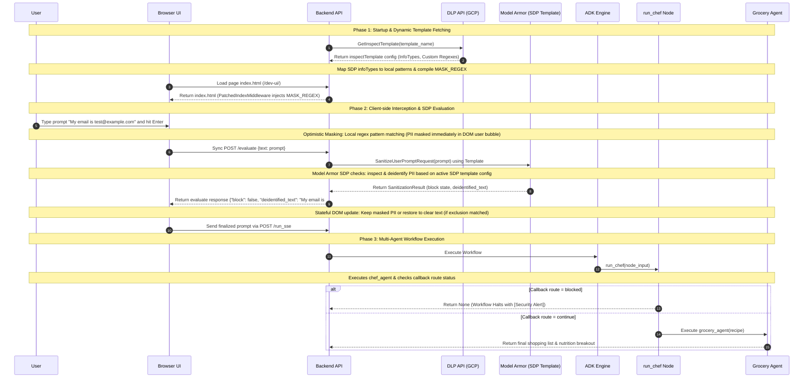
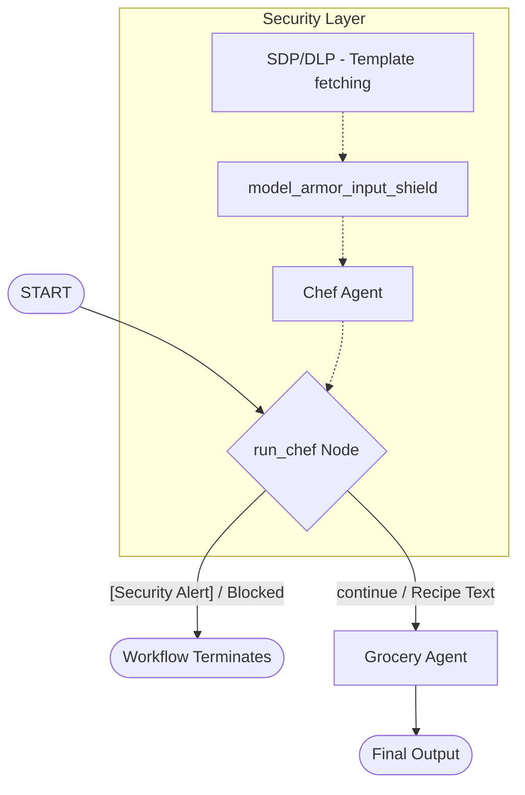

**Architecture & Implementation Plan:**
# Multi-Agent Workflow w/Model Armor

This document serves as the complete technical spec and implementation reference for the **Smart Chef & Grocery Assistant** multi-agent workflow, featuring real-time client-side prompt shielding and backend Model Armor protection.

---

## 🏗️ 1. System Architecture

The application splits responsibilities between specialized agents orchestrated by an ADK Workflow, wrapped in a client-side masking and security layer.



### Multi-Agent Orchestration Graph:



---

## 💻 2. Complete Backend Implementation

### Multi-Agent Definition (`chef_grocery_app/agent.py`)

This file defines the specialized agents (`chef_agent` and `grocery_agent`), the node wrapper (`run_chef`), and the core Model Armor check callback.

```python
from google.adk import Agent
from google.adk.workflow import Workflow, START, node
from google.genai import types
from google.cloud import modelarmor_v1
from google.api_core.client_options import ClientOptions
from google.adk.plugins.plugin_manager import PluginManager
from google.adk.plugins.base_plugin import BasePlugin
from google.adk.models.llm_response import LlmResponse
import logging
from . import services

# Set up logging
logger = logging.getLogger("model_armor")
logger.setLevel(logging.INFO)

# Initialize Model Armor Client for us-central1 region
client_options = ClientOptions(api_endpoint="modelarmor.us-central1.rep.googleapis.com")
model_armor_client = modelarmor_v1.ModelArmorClient(client_options=client_options)
TEMPLATE_NAME = "projects/my-project-76851-371010/locations/us-central1/templates/agent-shield"


def evaluate_and_sanitize_prompt(prompt_text: str) -> tuple[bool, str | None]:
    """Evaluates the prompt text with Model Armor.
    
    Returns:
        (block_flag, deidentified_text)
    """
    request = modelarmor_v1.SanitizeUserPromptRequest(
        name=TEMPLATE_NAME,
        user_prompt_data=modelarmor_v1.DataItem(text=prompt_text)
    )
    response = model_armor_client.sanitize_user_prompt(request=request)
    result = response.sanitization_result

    block = False
    for filter_name in ["rai", "pi_and_jailbreak", "malicious_uris", "csam"]:
        filter_res = result.filter_results.get(filter_name)
        if filter_res:
            res_val = getattr(filter_res, f"{filter_name}_filter_result", None)
            if not res_val and filter_name == "csam":
                res_val = getattr(filter_res, "csam_filter_filter_result", None)
            if res_val and getattr(res_val, "match_state", None) == modelarmor_v1.FilterMatchState.MATCH_FOUND:
                block = True
                break

    deidentified_text = None
    sdp_res = result.filter_results.get("sdp")
    if sdp_res and sdp_res.sdp_filter_result:
        sdp_filter_result = sdp_res.sdp_filter_result
        
        found_infotypes = set()
        if sdp_filter_result.inspect_result and sdp_filter_result.inspect_result.findings:
            found_infotypes = {finding.info_type for finding in sdp_filter_result.inspect_result.findings}
            
        deidentified_infotypes = set()
        if sdp_filter_result.deidentify_result and sdp_filter_result.deidentify_result.info_types:
            deidentified_infotypes = set(sdp_filter_result.deidentify_result.info_types)
            if sdp_filter_result.deidentify_result.match_state == modelarmor_v1.FilterMatchState.MATCH_FOUND:
                deidentified_text = sdp_filter_result.deidentify_result.data.text
                
        unmasked_infotypes = found_infotypes - deidentified_infotypes
        if unmasked_infotypes:
            block = True
        elif sdp_filter_result.inspect_result and sdp_filter_result.inspect_result.match_state == modelarmor_v1.FilterMatchState.MATCH_FOUND and not deidentified_text:
            block = True
        elif deidentified_text is not None:
            block = True

    return block, deidentified_text


class ModelArmorPlugin(BasePlugin):
    def __init__(self):
        super().__init__(name="model_armor_plugin")

    async def on_user_message_callback(
        self,
        *,
        invocation_context,
        user_message: types.Content,
    ) -> types.Content | None:
        """Sanitize prompt before it is saved or yielded to the client."""
        import sys
        if not user_message or not user_message.parts:
            return None

        prompt_text = "".join(part.text for part in user_message.parts if part.text)
        if not prompt_text:
            return None

        print(f"ModelArmorPlugin.on_user_message_callback: Received user prompt: {prompt_text}", file=sys.stderr, flush=True)

        block, deidentified_text = evaluate_and_sanitize_prompt(prompt_text)

        if block:
            print("ModelArmorPlugin.on_user_message_callback: Blocked prompt", file=sys.stderr, flush=True)
            return types.Content(
                parts=[types.Part.from_text(
                    text="[Security Alert] Your request was blocked by security filters."
                )]
            )
        
        if deidentified_text is not None:
            print(f"ModelArmorPlugin.on_user_message_callback: Masking prompt to: {deidentified_text}", file=sys.stderr, flush=True)
            return types.Content(
                parts=[types.Part.from_text(text=deidentified_text)]
            )
            
        return None

    async def after_model_callback(
        self,
        *,
        callback_context,
        llm_response: LlmResponse,
    ) -> LlmResponse | None:
        """Sanitize the LLM response before it is returned."""
        import sys
        if not llm_response or not llm_response.content or not llm_response.content.parts:
            return None

        response_text = "".join(part.text for part in llm_response.content.parts if part.text)
        if not response_text:
            return None

        print(f"ModelArmorPlugin.after_model_callback: Sanitizing response: {response_text}", file=sys.stderr, flush=True)

        request = modelarmor_v1.SanitizeModelResponseRequest(
            name=TEMPLATE_NAME,
            model_response_data=modelarmor_v1.DataItem(text=response_text)
        )
        response = model_armor_client.sanitize_model_response(request=request)
        result = response.sanitization_result

        block = False
        for filter_name in ["rai", "pi_and_jailbreak", "malicious_uris", "csam"]:
            filter_res = result.filter_results.get(filter_name)
            if filter_res:
                res_val = getattr(filter_res, f"{filter_name}_filter_result", None)
                if not res_val and filter_name == "csam":
                    res_val = getattr(filter_res, "csam_filter_filter_result", None)
                if res_val and getattr(res_val, "match_state", None) == modelarmor_v1.FilterMatchState.MATCH_FOUND:
                    block = True
                    break

        deidentified_text = None
        sdp_res = result.filter_results.get("sdp")
        if sdp_res and sdp_res.sdp_filter_result:
            sdp_filter_result = sdp_res.sdp_filter_result
            
            found_infotypes = set()
            if sdp_filter_result.inspect_result and sdp_filter_result.inspect_result.findings:
                found_infotypes = {finding.info_type for finding in sdp_filter_result.inspect_result.findings}
                
            deidentified_infotypes = set()
            if sdp_filter_result.deidentify_result and sdp_filter_result.deidentify_result.info_types:
                deidentified_infotypes = set(sdp_filter_result.deidentify_result.info_types)
                if sdp_filter_result.deidentify_result.match_state == modelarmor_v1.FilterMatchState.MATCH_FOUND:
                    deidentified_text = sdp_filter_result.deidentify_result.data.text
                    
            unmasked_infotypes = found_infotypes - deidentified_infotypes
            if unmasked_infotypes:
                block = True
            elif sdp_filter_result.inspect_result and sdp_filter_result.inspect_result.match_state == modelarmor_v1.FilterMatchState.MATCH_FOUND and not deidentified_text:
                block = True

        if block:
            print("ModelArmorPlugin.after_model_callback: Blocked response", file=sys.stderr, flush=True)
            new_response = llm_response.model_copy()
            new_response.content = types.Content(
                role="model",
                parts=[types.Part.from_text(
                    text="[Security Alert] The response was blocked by security filters."
                )]
            )
            return new_response

        if deidentified_text is not None:
            print(f"ModelArmorPlugin.after_model_callback: Masking response to: {deidentified_text}", file=sys.stderr, flush=True)
            new_response = llm_response.model_copy()
            new_response.content = types.Content(
                role="model",
                parts=[types.Part.from_text(text=deidentified_text)]
            )
            return new_response

        return None

# Monkeypatch PluginManager to always register our plugin
original_plugin_manager_init = PluginManager.__init__

def patched_plugin_manager_init(self, plugins=None, *args, **kwargs):
    if plugins is None:
        plugins = []
    if not any(isinstance(p, ModelArmorPlugin) for p in plugins):
        plugins.append(ModelArmorPlugin())
    original_plugin_manager_init(self, plugins, *args, **kwargs)

PluginManager.__init__ = patched_plugin_manager_init


def model_armor_input_shield(callback_context) -> types.Content | None:
    """Check if the prompt was flagged for blocking or requires masking inside workflow node."""
    import sys
    print(f"model_armor_input_shield entered! session events: {[(e.author, e.message) for e in callback_context.session.events] if callback_context.session else []}", file=sys.stderr, flush=True)
    user_content = callback_context.user_content
    if not user_content or not user_content.parts:
        for event in reversed(callback_context.session.events):
            if event.author == "user" and event.content:
                user_content = event.content
                break
                
    if not user_content or not user_content.parts:
        return None

    prompt_text = "".join(part.text for part in user_content.parts if part.text)
    if not prompt_text:
        return None

    if "[Security Alert]" in prompt_text:
        print("model_armor_input_shield: Security alert detected, blocking the request", file=sys.stderr, flush=True)
        callback_context.route = "blocked"
        return user_content

    block, deidentified_text = evaluate_and_sanitize_prompt(prompt_text)

    if block:
        print("model_armor_input_shield: Prompt blocked inside workflow context", file=sys.stderr, flush=True)
        callback_context.route = "blocked"
        return types.Content(
            parts=[types.Part.from_text(
                text="[Security Alert] Your request was blocked by security filters."
            )]
        )

    if deidentified_text is not None:
        print(f"model_armor_input_shield: Masking workflow node input prompt to: {deidentified_text}", file=sys.stderr, flush=True)
        user_content.parts = [types.Part.from_text(text=deidentified_text)]
        for event in reversed(callback_context.session.events):
            if event.author == "user" and event.content:
                event.content.parts = [types.Part.from_text(text=deidentified_text)]
                break
        
    callback_context.route = "continue"
    return None


# 1. Define Chef Agent (handles Task 1)
chef_agent = Agent(
    name="chef_agent",
    model="gemini-2.5-flash",
    instruction=(
        "You are an expert chef. Create a detailed recipe based on the user's request, "
        "incorporating any ingredients they want to use. List the exact ingredients and step-by-step instructions."
    ),
    before_agent_callback=model_armor_input_shield,
    rerun_on_resume=True
)

# Wrapper node to execute chef_agent and propagate route state
@node(rerun_on_resume=True)
async def run_chef(ctx, node_input) -> str:
    recipe = await ctx.run_node(chef_agent, node_input=node_input, use_as_output=True)
    if recipe is None:
        return None
    if "[Security Alert]" in recipe:
        return recipe
    ctx.route = "continue"
    return recipe


# 2. Define Grocery Agent (handles Task 2)
grocery_agent = Agent(
    name="grocery_agent",
    model="gemini-2.5-flash",
    instruction=(
        "You are a shopping assistant. Analyze the incoming recipe. Generate a clean, "
        "categorized shopping list for the ingredients the user needs to buy (exclude ingredients they already have). "
        "Also estimate the basic nutritional info (calories, protein, carbs, fat) for the recipe."
    )
)

# 3. Create the multi-agent workflow
chef_grocery_workflow = Workflow(
    name="chef_grocery_workflow",
    edges=[
        (START, run_chef),
        (run_chef, {
            "continue": grocery_agent
        })
    ]
)

# 4. Set entrypoint
root_agent = chef_grocery_workflow
```

---

## 🌐 3. Real-Time Client-Side Prompt Shielding (`chef_grocery_app/services.py`)

This file dynamically parses active infoType patterns from the Google Cloud Sensitive Data Protection (SDP) templates on GCP, hooks into HTTP/XHR transport layers inside the browser via custom ASGI middleware, and injects a zero-latency MutationObserver masking script.

*   Refer to the live code repository at [chef_grocery_app/services.py](file:///usr/local/google/home/maorhz/Documents/Code/google-adk-learning/chef_grocery_app/services.py) for the complete ASGI middleware string injection, DLP API call configurations, and client-side XMLHttpRequest/Fetch hook wrappers.
*   **Key Routing Rule**: The evaluation endpoint is registered at `/evaluate` on the root FastAPI app, which successfully forwards requests through Google Frontend proxy routing limits.
