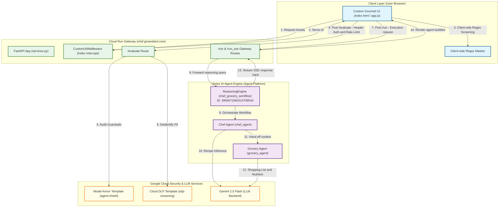

# Multi-Agent Platform Architecture & Working Model

Here is the architectural diagram and request lifecycle flow describing how the Gourmet Chef multi-agent system operates now that the backend has been migrated to **Vertex AI Agent Engine (Agent Platform)**.

---

## 1. System Architecture Diagram

This diagram shows the relationship between the client browser, the Cloud Run UI Gateway, the managed Vertex AI Agent Engine, and GCP security services.

---

## 2. High Level Architecture

Here is the high-fidelity system topology diagram mapping the layout and components:

---

## 3. End-to-End Request Lifecycle

The system operates using a hybrid model designed to keep custom DNS routing (`chef.gmandiant.com`) active while offloading 100% of LLM execution and state management to the Agent Platform:

### 1. Page Load & Middleware Interception
* The user navigates to **`chef.gmandiant.com`**.
* The load balancer routes the request to the Cloud Run service.
* `CustomUIMiddleware` intercepts the request and serving the custom gourmet UI (`index.html`) embedded in the application.

### 2. Guardrails & Prompt Evaluation (`/evaluate`)
* When the user types a prompt (e.g., sharing a recipe request containing PII or email address), `app.js` runs a local regex scan and displays real-time `[redacted]` indicators.
* The client sends the prompt to the Cloud Run `/evaluate` endpoint with a valid `X-Session-ID` header.
* The `/evaluate` route enforces rate limiting (15 requests/min) and calls:
  * **Model Armor**: Scans for prompt injection, jailbreaks, and malicious URLs.
  * **Cloud DLP**: Audits, classifies, and deidentifies sensitive infotypes.
* If blocked or sanitized, a modal is displayed to the user showing the details.

### 3. Agent Execution & Stream (`/run`)
* If `/evaluate` clears the prompt, the client triggers the workflow execution via `/run`.
* The Cloud Run backend receives the request and forwards it to the deployed **Vertex AI ReasoningEngine instance (`3906571960313708544`)**.
* **Vertex AI Agent Engine** runs the ADK workflow:
  1. Activates **`chef_agent`** to construct the gourmet recipe step-by-step.
  2. Activates **`grocery_agent`** to generate the categorized shopping list and calculate nutritional details.
* The Reasoning Engine streams the tokens back to Cloud Run, which forwards them directly to the client browser via Server-Sent Events (SSE).
