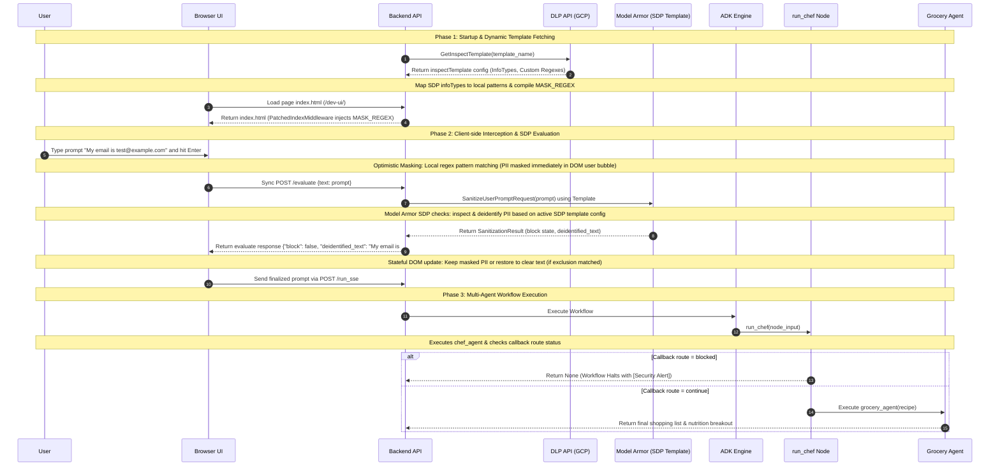

# Walkthrough: Smart Chef & Grocery Assistant (Google ADK)

This document serves as the unified project walkthrough and documentation for the **Smart Chef & Grocery Assistant**, built using the **Google Agent Development Kit (ADK)** in Python.

---

## 🌟 1. Project Concept
The application takes a user's food craving, ingredients on hand, or diet preferences, and performs two sequential tasks:
1. **Recipe Creation**: Designs a customized, detailed recipe using Gemini.
2. **Grocery Planning**: Analyzes the recipe to output a clean, categorized shopping list (excluding ingredients the user already has) and an estimated nutritional breakdown.

---

## 🛠️ 2. Project Setup & Directory
All files are organized in the following local directory:
`/usr/local/google/home/maorhz/Documents/Code/google-adk-learning`

### Setup Steps:
1. **Virtual Environment**:
   ```bash
   python3.11 -m venv venv --without-pip
   source venv/bin/activate
   ```
2. **Pip Installation** (due to system-level staging repository overrides):
   ```bash
   curl -sSL https://bootstrap.pypa.io/get-pip.py -o get-pip.py
   python get-pip.py --index-url https://pypi.org/simple
   rm get-pip.py
   ```
3. **Google ADK Library**:
   ```bash
   pip install google-adk --index-url https://pypi.org/simple
   ```

---

## ⚙️ 3. Application Optimization Journey

### Phase 1: Multi-Agent Workflow (Initial Design)
We initially designed the system with two separate agents (`chef_agent` and `grocery_agent`) executing in sequence within a `Workflow` graph.

While functional, this triggered a **System Instruction Performance Alert** in the ADK Developer UI. Swapping the system instructions (`You are an expert chef...` to `You are a shopping coordinator...`) between consecutive turns in the same session invalidated Gemini's **context caching**, resulting in cache misses and increased response latency.

### Phase 2: Single-Agent Consolidation (Optimized Design)
To maximize caching efficiency, we consolidated both personas into a single, unified agent that executes the tasks sequentially in a single turn.

#### Final Code (`chef_grocery_app/agent.py`):
```python
from google.adk import Agent

# Define the consolidated agent
chef_and_grocery_agent = Agent(
    name="chef_and_grocery_agent",
    model="gemini-2.5-flash",
    instruction=(
        "You are an expert culinary assistant. Perform the following two tasks in sequence:\n\n"
        "Task 1: Create a detailed recipe based on the user's request, incorporating "
        "any ingredients they want to use. List the exact ingredients and step-by-step instructions.\n\n"
        "Task 2: Analyze the recipe you created. Generate a clean, categorized shopping list "
        "for the ingredients the user needs to buy (exclude ingredients they already have). "
        "Also estimate the basic nutritional info (calories, protein, carbs, fat) for the recipe."
    )
)

# Set the single agent as the root_agent
root_agent = chef_and_grocery_agent
```

---

## 🖥️ 4. Local CLI Execution (RTL/Hebrew Formatting)
To interact with the agent locally in your terminal, we created a custom runner script `run.py`. 

Because modern terminal emulators already support Right-to-Left (RTL) rendering, we output the raw logical text stream directly without visual formatting libraries (which would otherwise invert the characters).

#### CLI Runner (`run.py`):
```python
import asyncio
import os
import sys
from dotenv import load_dotenv
from google.adk.runners import InMemoryRunner
from chef_grocery_app.agent import root_agent

# Load environment configuration
dotenv_path = os.path.join(os.path.dirname(__file__), 'chef_grocery_app', '.env')
load_dotenv(dotenv_path)

def print_friendly_event(event) -> None:
    if not event.content or not event.content.parts:
        return
    text_buffer = [part.text for part in event.content.parts if part.text]
    if text_buffer:
        print(f"{event.author} > {''.join(text_buffer)}")

async def main():
    runner = InMemoryRunner(agent=root_agent, app_name="chef_grocery_app")
    
    # Query Mode
    if len(sys.argv) > 1:
        query = " ".join(sys.argv[1:])
        print(f"Running single query: {query}\n")
        events = await runner.run_debug(query, quiet=True)
        for event in events:
            print_friendly_event(event)
        return

    # Interactive CLI Mode
    print("=== Chef & Grocery Agent (CLI Mode) ===")
    print("Type 'exit' or 'quit' to end the session.\n")
    while True:
        try:
            user_input = input("You: ")
            if user_input.strip().lower() in ["exit", "quit"]:
                break
            if not user_input.strip():
                continue
            events = await runner.run_debug(user_input, quiet=True)
            print("\nAgent:")
            for event in events:
                print_friendly_event(event)
            print("-" * 40)
        except (KeyboardInterrupt, EOFError):
            print("\nGoodbye!")
            break

if __name__ == "__main__":
    asyncio.run(main())
```

---

## ☁️ 5. Cloud Run Deployment & Security

We deployed the application to Google Cloud Run with the ADK Web UI enabled.

### Deployment Command:
```bash
venv/bin/adk deploy cloud_run --project=my-project-76851-371010 --region=us-central1 --with_ui chef_grocery_app
```

### IAM Vertex AI User Permission Binding
To allow the server backend to authenticate to Vertex AI, we granted the **Vertex AI User** (`roles/aiplatform.user`) role to the Cloud Run Default Service Account:
```bash
gcloud projects add-iam-policy-binding my-project-76851-371010 \
  --member="serviceAccount:855384940829-compute@developer.gserviceaccount.com" \
  --role="roles/aiplatform.user"
```

### Restricting Access & Authenticating Users (IAM Invoker)
To prevent unauthorized public access, we removed `allUsers` permissions and restricted access to specific authenticated accounts:

1. **Remove public access**:
   ```bash
   gcloud run services remove-iam-policy-binding adk-default-service-name \
     --member="allUsers" \
     --role="roles/run.invoker" \
     --project=my-project-76851-371010 \
     --region=us-central1
   ```

2. **Grant access to authorized users**:
   ```bash
   gcloud run services add-iam-policy-binding adk-default-service-name \
     --member="user:gadmin@maorhz.altostrat.com" \
     --role="roles/run.invoker" \
     --project=my-project-76851-371010 \
     --region=us-central1

   gcloud run services add-iam-policy-binding adk-default-service-name \
     --member="user:maorhz@google.com" \
     --role="roles/run.invoker" \
     --project=my-project-76851-371010 \
     --region=us-central1
   ```

### Accessing the Secured Web UI (Local Proxy)
When the service is restricted, visiting the Cloud Run URL directly in a browser results in `403 Forbidden`. You must use a local proxy to sign requests:

1. **Install Cloud Run Proxy component** (if not already installed/managed):
   ```bash
   sudo apt-get install google-cloud-cli-cloud-run-proxy
   ```
2. **Start the local authentication proxy**:
   ```bash
   gcloud beta run services proxy adk-default-service-name \
     --project=my-project-76851-371010 \
     --region=us-central1
   ```
3. Open the printed local proxy URL in your browser (typically **`http://localhost:8080`** or `http://127.0.0.1:8080`) to access the Visual Web UI console securely.

---

## 🛡️ 6. Model Armor Prompt Shielding & Multi-Agent Routing

We configured **Google Cloud Model Armor** to secure the LLM application against prompt injection, jailbreaks, PII leakage, and malicious URLs. The application was split into a multi-agent workflow containing a security callback block that cleanly stops downstream execution without duplicating UI replies.

### IAM Permissions
We granted the **Model Armor User** (`roles/modelarmor.user`) role to the Cloud Run service account:
```bash
gcloud projects add-iam-policy-binding my-project-76851-371010 \
  --member="serviceAccount:855384940829-compute@developer.gserviceaccount.com" \
  --role="roles/modelarmor.user"
```

### Multi-Agent Workflow Implementation
The application is structured as a `Workflow` containing two agents: `chef_agent` and `grocery_agent`.

1. **Model Armor Callback**:
   We added a `before_agent_callback` named `model_armor_input_shield` to `chef_agent`. This callback calls Model Armor's `sanitize_user_prompt` API using the template `projects/my-project-76851-371010/locations/us-central1/templates/agent-shield`.
   *   If blocked, it emits a single event containing the warning `[Security Alert] Your request was blocked by security filters.` and halts the agent run.

2. **Clean Conditional Routing**:
   We wrapped `chef_agent` inside a custom `@node(rerun_on_resume=True)` wrapper function named `run_chef`.
   *   `run_chef` executes the `chef_agent` node using `ctx.run_node(chef_agent, ..., use_as_output=True)`. This suppresses duplicate recipe output events by delegating `chef_agent`'s output directly to the wrapper.
   *   If `chef_agent` returned `None` (was blocked), `run_chef` returns `None` immediately without setting a route value. Because no route is set and no default route is configured in the routing map, the workflow terminates cleanly with only the original security alert event printed.
   *   If safe, `run_chef` sets `ctx.route = "continue"`, which matches the routing map key to run `grocery_agent`.


```python
# 3. Create the multi-agent workflow with conditional routing
chef_grocery_workflow = Workflow(
    name="chef_grocery_workflow",
    edges=[
        (START, run_chef),
        (run_chef, {
            "continue": grocery_agent
        })
    ]
)
```

---

## 🛡️ 7. Real-Time Client-Side Prompt Shielding & Masking

To protect PII before it is displayed or stored in local UI histories, we implemented a real-time client-side shielding layer that integrates with the backend Google Cloud Model Armor SDP template.

### Core Capabilities:
1. **Zero-Latency Dynamic Optimistic Masking**: Eliminates the "visual flash of unmasked text" by pre-masking PII (emails, credit cards, street addresses, etc.) locally in the DOM as soon as the user hits Enter.
2. **Automated SDP Template Parsing**: The backend queries the live Google Cloud Sensitive Data Protection (DLP) inspectTemplate API (`projects/my-project-76851-371010/locations/us-central1/inspectTemplates/2828347596800781685`) to dynamically load active infoTypes and custom regex rules, compiling them into a combined regex alternation on the client.
3. **5-Minute Template Caching**: Updates made in the Google Cloud Console propagate to browser sessions within 5 minutes without restarting any backend service.
4. **Accurate SDP Exclusions**: Queries the Model Armor backend to validate whether a match is excluded (e.g., `maor@google.com` matching the exclusion regex).
5. **Stateful DOM Restoration**: Utilizes `node._originalValue` state property to dynamically restore excluded PII back to clear text without losing data.
6. **Dual XHR & Fetch Hooks**: Intercepts both standard browser `fetch` requests and Angular HttpClient's `XMLHttpRequest` (XHR) calls.

### Architecture Overview:



### Complete Implementation Details:
*   **ASGI Middleware**: [PatchedIndexMiddleware](file:///usr/local/google/home/maorhz/Documents/Code/google-adk-learning/chef_grocery_app/services.py#L130) intercepts the HTML response of `/dev-ui/` and dynamically injects the shielding code into the HTML `<head>` tag.
*   **DLP API Integration**: Uses credentials with custom quota-project overrides to dynamically fetch templates from the REST endpoint (`https://dlp.googleapis.com/v2/...`), extracting both standard built-in rulesets and custom regex patterns.
*   **XHR Hook**: Overrides `XMLHttpRequest.prototype.open` and `XMLHttpRequest.prototype.send` to perform a synchronous blocking call to `/evaluate` before the `/run_sse` stream is dispatched.
*   **DOM Observer**: Uses a standard browser `MutationObserver` combined with `element._originalValue` state properties to ensure clean text replacements without permanently losing node values.


